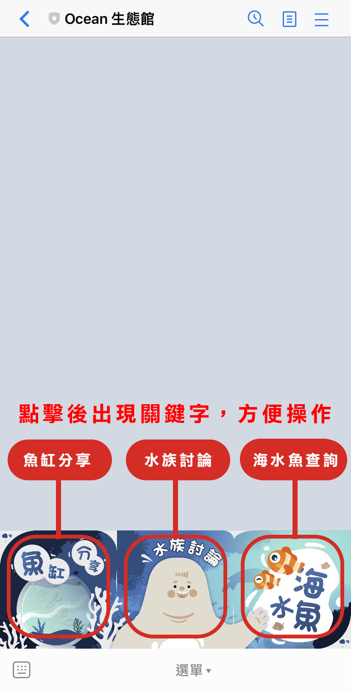
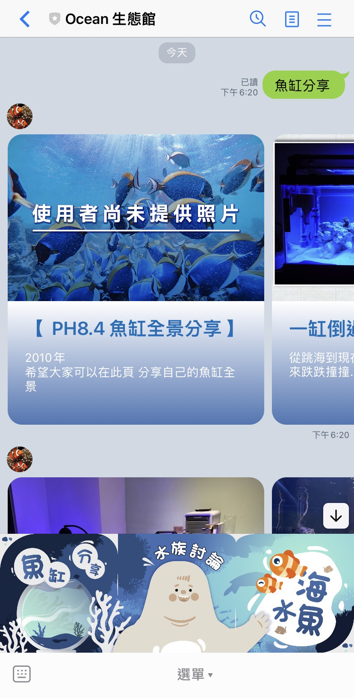
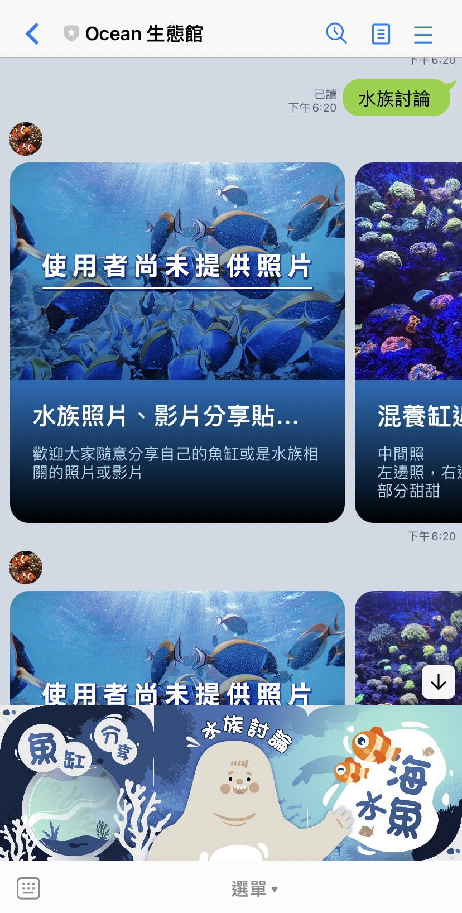
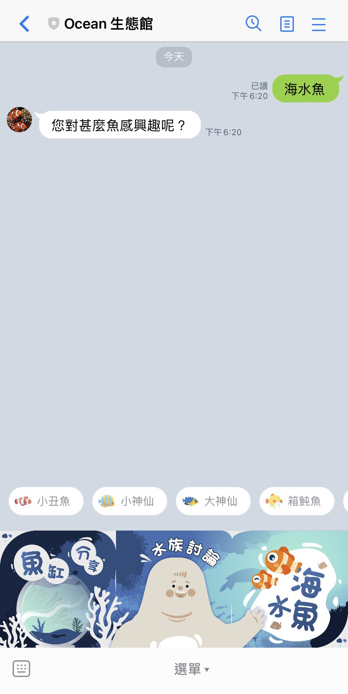
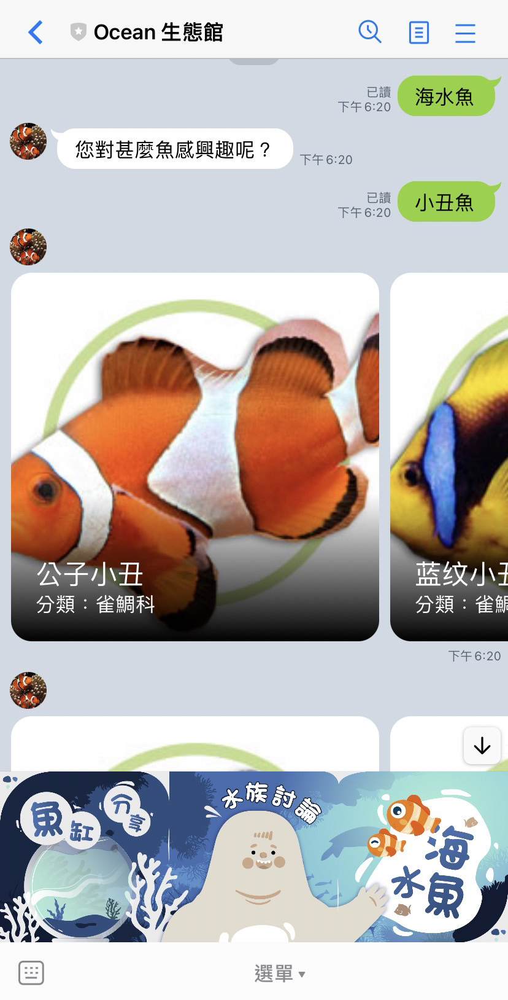

# Ocean 生態館 - linebot

line 機器人作業

海水魚全攻略

> - 魚缸分享
> - 水族討論
> - 海水魚介紹

## 目錄

- [LineID](#ID)
- [操作說明](#Instruction)
- [API 資料來源](#API)

## LineID

- line ID: @034sdmgb
- 掃描 QRcode 
  

  ## 操作說明

1. 基本操作說明
   

2. 選擇魚缸分享
   

3. 選擇水族討論
   

4. 選擇海水魚
   
   

## API 資料來源

- 此機器人使用 [PH8.4 海水廣賞魚網頁](https://www.ph84.idv.tw/forum/forums/) 與 [cmf 海友網](https://www.cmfish.com/mobile/kinds/kind1.php)
